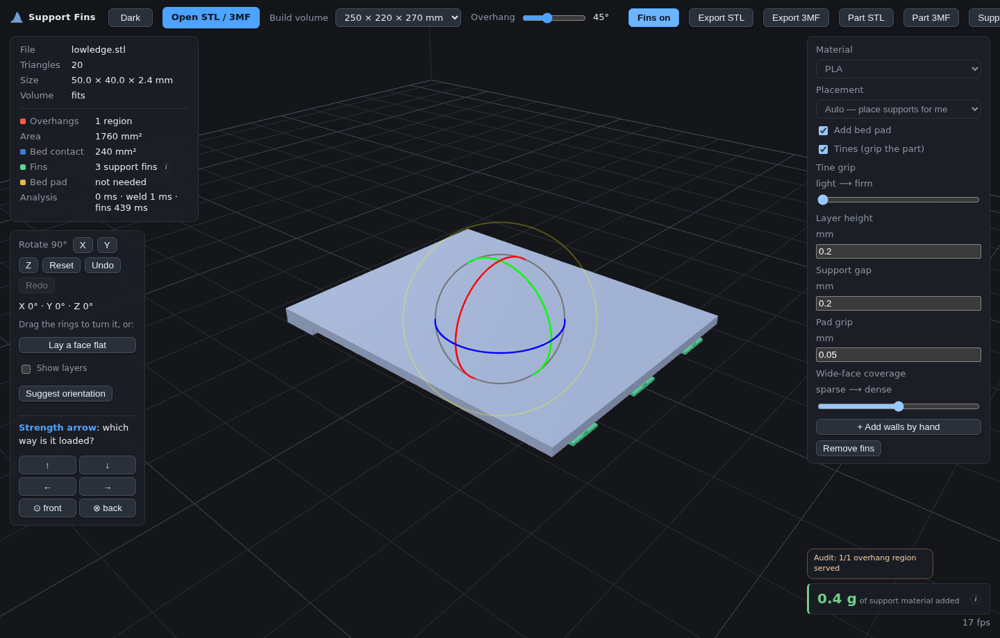
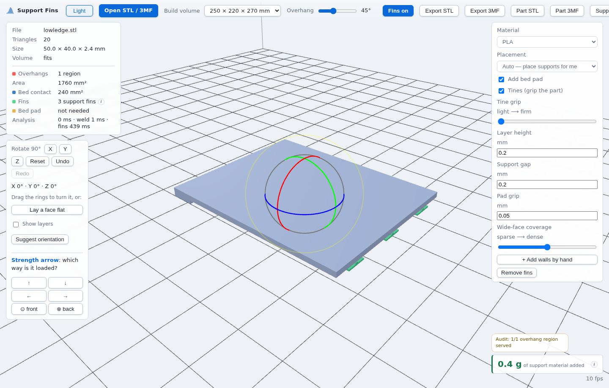

# Support Fins — rcarmo fork

This repository is a custom fork of Support Fins for local experimentation with mesh import, support-generation UX and browser-only export workflows.

Support Fins opens an STL or mesh 3MF in the browser, lets you choose the print orientation, adds breakaway support fins and exports printable STL or 3MF geometry. Files stay in the browser tab. There is no backend service.





## Changes in this fork

This fork keeps the browser app as vanilla ES modules and adds local test coverage around the geometry path.

- Bun-based test, stress and profiling scripts.
- Mesh 3MF import with unit, transform, component, DEFLATE and ZIP64 coverage.
- CAD/STEP payload detection for 3MF packages. CAD payloads are reported, not converted.
- Per-fin removal for generated supports.
- Support-only and oriented part-only STL/3MF exports.
- Named 3MF objects for part, support fins and bed pad where slicers preserve object names.
- A visible support audit summary in the UI.
- Light and dark themes with a saved local preference.
- A local browser smoke test that loads a fixture, enables fins and verifies export handlers.
- Opt-in phase profiling for `buildFins(..., { profile })`, surfaced through `bun run profile`.

## Advertising and external links

Promo links are disabled by default in this fork.

`web/config.js` exports:

```js
export const SHOW_PROMO_LINKS = globalThis.SUPPORT_FINS_SHOW_PROMO_LINKS === true;
```

Leave it as-is for a neutral build. Set `globalThis.SUPPORT_FINS_SHOW_PROMO_LINKS = true` before loading `app.js`, or edit a deployment-specific copy of `web/config.js`, to show donation or advertising links.

## How it works

1. Load an STL or mesh 3MF.
2. Rotate the part. The app can suggest orientations, but the user chooses the final pose.
3. Inspect overhangs, bed contact, support coverage and load-direction scoring.
4. Enable fins and tune the support options when needed.
5. Export combined, part-only or support-only STL/3MF files.

The output is geometry-only. The app does not embed slicer profiles. Bambu Studio and PrusaSlicer can show a “geometry only” or “no config” notice when opening exported 3MF files. That notice is expected; the geometry imports in the chosen orientation and units.

3MF import is mesh-first. Printable triangle geometry is loaded. Slicer settings and non-printable/support bodies are ignored. CAD/STEP payloads inside a 3MF are detected and reported. A CAD/STEP-only 3MF must be tessellated to STL or mesh 3MF before this app can process it.

## Run locally

Serve the static `web/` directory with the included development server:

```bash
python3 dev-server.py                      # http://localhost:8731/
python3 dev-server.py 8080                 # custom port
python3 dev-server.py --host 0.0.0.0       # LAN access
```

By default the server binds to `127.0.0.1`. Use `--host 0.0.0.0` only when you want to expose it on the local network.

Docker is also available:

```bash
docker compose up --build                  # http://localhost:8731/
```

The image serves static files through nginx. There is no application server.

## Tests, smoke tests and profiling

Use Bun for the JavaScript test suite:

```bash
bun run test
```

Run the browser smoke test when Chromium is available:

```bash
PLAYWRIGHT_BROWSERS_PATH=/workspace/bin/pw-browsers bun run smoke:browser
```

The smoke test starts a local static server, opens the app in Chromium, loads `prototype/stress/models/lowledge.stl`, enables fins and verifies that part/support STL and 3MF export handlers produce non-empty blobs.

Run the profiling harness against a binary STL fixture:

```bash
bun run profile prototype/stress/models/lowledge.stl 0 auto
```

The profiler prints topology size, overhang counts, support counts, triangle counts, total analysis/build timings and `phaseMs` timings from the opt-in `buildFins(..., { profile })` hook.

## Repository layout

```text
web/         browser app
prototype/   proof-of-concept and stress fixture tooling
docs/        design notes, geometry backlog and screenshots
tests/       Bun regression tests
scripts/     local profiling and browser smoke scripts
```

The active codebase does not include slicer plugin code. Earlier PrusaSlicer Lua plugin experiments were removed because they were not functional and were outside the browser workflow.

## Limitations

- The app works on mesh geometry. It does not tessellate CAD kernels or convert STEP data.
- Supports are generated from the part to the bed. Overhangs above other part geometry still need review.
- Very short features can be too low for a useful breakaway fin.
- The user still chooses the orientation. Geometry does not contain the load direction or functional intent of the part.

## Upstream and licence

This fork derives from `gittrahan/support-fins`.

The project is licensed under the MIT licence. The licence covers the tool. It does not add obligations to models processed with it.
